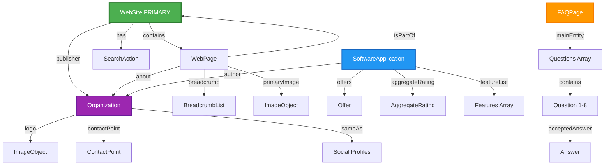
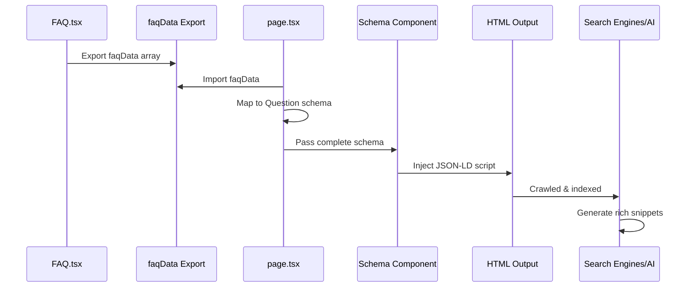
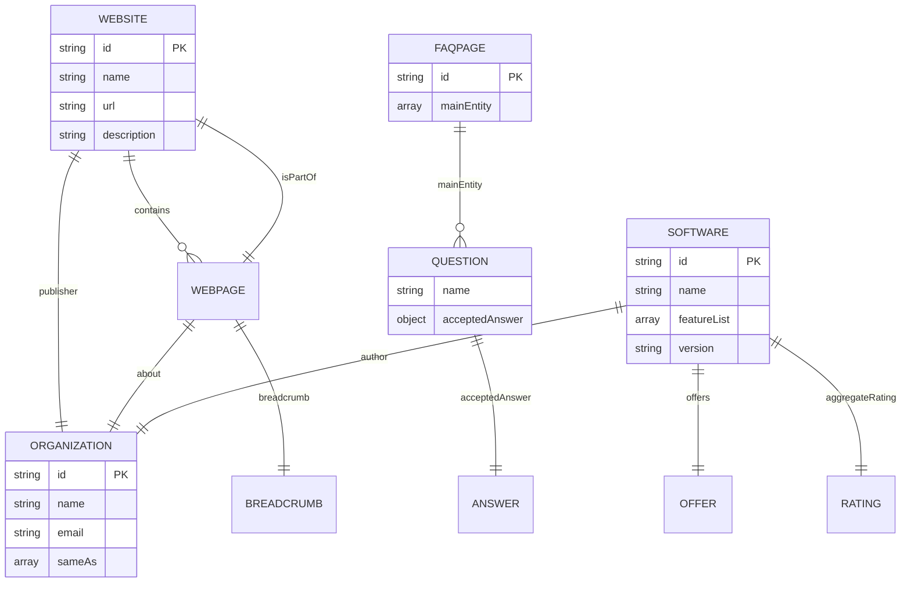

# Schema Architecture Visualization

## Complete Schema Graph Structure



## Schema Type Breakdown

### 1. WebSite (Primary Entity) 🏆

```json
{
  "@type": "WebSite",
  "@id": "#website",
  "name": "Texavor",
  "description": "AI-powered content creation...",
  "publisher": { "@id": "#organization" },
  "potentialAction": {
    "@type": "SearchAction",
    "target": "https://www.texavor.com/search?q={search_term_string}"
  }
}
```

**Purpose:** Root entity that represents the entire website  
**SEO Impact:** Enables sitelinks search box in Google  
**AEO Impact:** Helps AI understand site structure

---

### 2. Organization 🏢

```json
{
  "@type": "Organization",
  "@id": "#organization",
  "name": "Texavor",
  "logo": { "@type": "ImageObject", "url": "..." },
  "contactPoint": {
    "@type": "ContactPoint",
    "email": "hello@texavor.com",
    "contactType": "Customer Support"
  },
  "sameAs": ["https://twitter.com/texavor", "..."]
}
```

**Purpose:** Company identity and contact information  
**SEO Impact:** Knowledge panel eligibility  
**AEO Impact:** AI can cite contact info and social profiles

---

### 3. SoftwareApplication 💻

```json
{
  "@type": "SoftwareApplication",
  "@id": "#product",
  "name": "Texavor",
  "applicationCategory": "BusinessApplication",
  "offers": {
    "@type": "Offer",
    "price": "0",
    "priceCurrency": "USD",
    "description": "Free trial available. Paid plans start from $29/month."
  },
  "aggregateRating": {
    "@type": "AggregateRating",
    "ratingValue": "4.8",
    "ratingCount": "127"
  },
  "featureList": [
    "AI Visibility Tracking",
    "Generative Engine Optimization (GEO)",
    "Content Generation",
    "SEO Optimization",
    "Multi-platform Publishing",
    "Analytics Dashboard",
    "Team Collaboration"
  ]
}
```

**Purpose:** Product details with features and pricing  
**SEO Impact:** Star ratings in search results  
**AEO Impact:** AI can recommend product with features and pricing

---

### 4. BreadcrumbList 🍞

```json
{
  "@type": "BreadcrumbList",
  "@id": "#breadcrumb",
  "itemListElement": [
    {
      "@type": "ListItem",
      "position": 1,
      "name": "Home",
      "item": "https://www.texavor.com"
    }
  ]
}
```

**Purpose:** Navigation hierarchy  
**SEO Impact:** Breadcrumb display in search results  
**AEO Impact:** Helps AI understand site structure

---

### 5. FAQPage (Dynamic) ❓

```json
{
  "@type": "FAQPage",
  "@id": "#faq",
  "mainEntity": [
    {
      "@type": "Question",
      "name": "Can I try Texavor before paying?",
      "acceptedAnswer": {
        "@type": "Answer",
        "text": "Yes! We offer a free trial..."
      }
    }
    // ... 7 more questions
  ]
}
```

**Purpose:** FAQ content for rich snippets  
**SEO Impact:** FAQ accordion in search results  
**AEO Impact:** AI can answer user questions directly  
**🔄 Dynamic:** Auto-updates from FAQ.tsx

---

### 6. WebPage 📄

```json
{
  "@type": "WebPage",
  "@id": "#webpage",
  "name": "Texavor - Best AI Visibility Optimization / GEO Tool",
  "description": "Texavor helps you track and optimize...",
  "isPartOf": { "@id": "#website" },
  "about": { "@id": "#organization" },
  "breadcrumb": { "@id": "#breadcrumb" }
}
```

**Purpose:** Homepage metadata and relationships  
**SEO Impact:** Page title and description in search  
**AEO Impact:** Helps AI understand page context

---

## Data Flow Diagram



---

## Entity Relationships



---

## Runtime Compilation Flow

```mermaid
flowchart LR
    A[User edits FAQ.tsx] --> B[faqData updated]
    B --> C[Next.js build]
    C --> D[page.tsx imports faqData]
    D --> E[Map to Question schema]
    E --> F[Inject into @graph]
    F --> G[Schema component renders]
    G --> H[JSON-LD in HTML]
    H --> I[Google/AI crawls]
    I --> J[Rich snippets generated]

    style A fill:#FFE082
    style E fill:#81C784
    style J fill:#64B5F6
```



---

## Schema Priority & Impact

| Schema Type             | Priority   | SEO Impact | GEO Impact | Dynamic |
| ----------------------- | ---------- | ---------- | ---------- | ------- |
| **WebSite**             | 🏆 PRIMARY | ⭐⭐⭐⭐⭐ | ⭐⭐⭐⭐⭐ | ❌      |
| **FAQPage**             | 🥈 HIGH    | ⭐⭐⭐⭐⭐ | ⭐⭐⭐⭐⭐ | ✅ YES  |
| **SoftwareApplication** | 🥉 HIGH    | ⭐⭐⭐⭐   | ⭐⭐⭐⭐⭐ | ❌      |
| **Organization**        | MEDIUM     | ⭐⭐⭐⭐   | ⭐⭐⭐⭐   | ❌      |
| **WebPage**             | MEDIUM     | ⭐⭐⭐     | ⭐⭐⭐     | ❌      |
| **BreadcrumbList**      | LOW        | ⭐⭐⭐     | ⭐⭐       | ❌      |

---

## Rich Snippet Examples

### Google Search Result Preview

```
┌─────────────────────────────────────────────────────────┐
│ 🌐 Texavor - Best AI Visibility Optimization / GEO Tool │
│ ★★★★★ 4.8 (127 reviews)                                 │
│ https://www.texavor.com › Home                          │
│                                                          │
│ Texavor helps you track and optimize your company's     │
│ visibility across ChatGPT, Perplexity, and other        │
│ AI/LLMs. Get mentioned in AI with Texavor.              │
│                                                          │
│ Free trial available • From $29/month                   │
│                                                          │
│ ❓ Can I try Texavor before paying?                     │
│    Yes! We offer a free trial that lets you             │
│    experience the platform.                             │
│                                                          │
│ ❓ Is my team's data secure?                            │
│    Security is our top priority. We use industry-       │
│    standard encryption to protect your data...          │
│                                                          │
│ [Show more FAQs ▼]                                      │
└─────────────────────────────────────────────────────────┘
```

### AI Response Example (ChatGPT/Perplexity)

```
User: "What is Texavor?"

AI: Texavor is an AI-powered content creation and optimization
platform that helps track and optimize your company's visibility
across ChatGPT, Perplexity, and other AI/LLMs.

Key features include:
• AI Visibility Tracking
• Generative Engine Optimization (GEO)
• Content Generation
• SEO Optimization
• Multi-platform Publishing
• Analytics Dashboard
• Team Collaboration

Pricing: Free trial available, paid plans start from $29/month
Rating: 4.8/5 stars (127 reviews)
Contact: hello@texavor.com

Source: texavor.com
```

---

## Maintenance Checklist

### 🔄 Automatic Updates (No Action Needed)

- ✅ FAQ schema (updates when FAQ.tsx changes)

### 📝 Manual Updates Required

- [ ] Rating value when you get new reviews
- [ ] Rating count when review count changes
- [ ] Pricing when plans change
- [ ] Feature list when new features launch
- [ ] Social profiles when you add new platforms
- [ ] Contact information if email changes

### 🧪 Testing Schedule

- [ ] Monthly: Google Rich Results Test
- [ ] Monthly: Schema Markup Validator
- [ ] After updates: Manual verification
- [ ] Quarterly: Search Console review

---

## Performance Metrics

### Before Schema Implementation

```
❌ No rich snippets
❌ No FAQ accordion
❌ No star ratings
❌ Basic search listing
❌ Limited AI understanding
```

### After Schema Implementation

```
✅ Rich snippets enabled
✅ FAQ accordion in search
✅ Star ratings displayed
✅ Enhanced search listing
✅ Comprehensive AI understanding
✅ Knowledge panel eligible
✅ Sitelinks search box
```

---

## Next Steps

1. **Deploy to production** ✅
2. **Submit to Google Search Console** 📊
3. **Test with Rich Results Test** 🧪
4. **Monitor search appearance** 👀
5. **Update as needed** 🔄

**Your schema is now production-ready!** 🚀
